# 🚀 Microservices Task

## 📂 Project Structure

``` bash
├── Microservices/
│   └── user-service/
│       ├── app.js
│       ├── Dockerfile
│       ├── package.json
│       └── .env
│   └── product-service/
│       ├── app.js
│       ├── Dockerfile
│       ├── package.json
│       └── .env
│   └── order-service/
│       ├── app.js
│       ├── Dockerfile
│       ├── package.json
│       └── .env
│   └── gateway-service/
│       ├── app.js
│       ├── Dockerfile
│       ├── package.json
│       └── .env
├── k8s/
│   ├── configmap/
│   │   ├── user-service.yaml
│   │   ├── product-service.yaml
│   │   ├── order-service.yaml
│   │   └── gateway-service.yaml
│   ├── deployments/
│   │   ├── user-service.yaml
│   │   ├── product-service.yaml
│   │   ├── order-service.yaml
│   │   └── gateway-service.yaml
│   ├── services/
│   │   ├── user-service.yaml
│   │   ├── product-service.yaml
│   │   ├── order-service.yaml
│   │   └── gateway-service.yaml
│   ├── ingress/
│   │   └── ingress.yaml
│   └── namespace.yaml
├── docker-compose.yml
├── images/
├── .gitignore
├── LICENSE
├── README.md
```

## 📋 Overview

This guide documents how to build, run, and validate four `Node.js` microservices using `Docker` and `Kubernetes` on Minikube:

* 👤 **User Service**
* 📦 **Product Service**
* 🧾 **Order Service**
* 🌐 **Gateway Service**

---

### ✅ Minikube Installation Steps (Linux/macOS/Windows)
🌐 Prerequisites:
- Virtualization enabled in BIOS/UEFI (for VirtualBox/Hyper-V/Docker backend)
- Installed:
    - kubectl (Kubernetes CLI)
    - Docker (optional, if using Docker as a driver)

[Minikube Install Link](https://minikube.sigs.k8s.io/docs/start)

🔍 Verify Minikube:
```
minikube version
```
⚙️ Start Minikube
```
minikube start --driver=docker
```
✅ Common drivers:
- `--driver=docker`
- `--driver=virtualbox`
- `--driver=hyperv (Windows)`

📦 Check Status & Cluster Info
```
minikube status
```
Verify Minikube Status, Version, Start

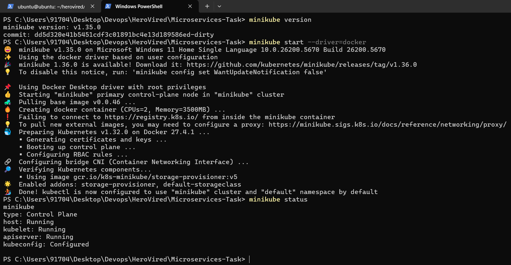

---

### 🌉 Create a Docker Network

Before running the services, create a Docker bridge network:

```bash
docker network create --driver bridge microservice
```

### 📛 Create a Kubernetes Namespace

Before deploying your services, it's a best practice to isolate them within a dedicated Kubernetes namespace.

A predefined namespace file is available at: `k8s/namespace.yml`
```bash
apiVersion: v1
kind: Namespace
metadata:
  name: microservice
```
🚀 Apply the Namespace
Use the following command to create the namespace in your cluster:
```bash
kubectl apply -f k8s/namespace.yml
```

---

## 👤 User Service

#### 🐳 Steps to Deploy an Application on Docker

📁 Create a `Dockerfile` inside the `user-service` directory:

```Dockerfile
FROM node:24-alpine

WORKDIR /app

COPY package*.json ./
COPY . .

RUN npm install

EXPOSE 3000

CMD ["node", "app.js"]
```

### 🔍 Local Testing & Validation

Build the Docker image:

```bash
docker image build --no-cache -t securelooper/user-service .
```


Push the image to Docker Hub.
```bash
docker image push securelooper/user-service
```

Run the container:

```bash
docker container run -d --name user-service -p 3000:3000 --network microservice -e NODE_ENV=production -e PORT=3000 securelooper/user-service
```

* **Base URL:** `http://localhost:3000`
* **Endpoint for List Users:**
    ```bash
    curl http://localhost:3000/users
    ```

    Or open in browser: [http://localhost:3000/users](http://localhost:3000/users)


### ☸️ Steps to Deploy an Application on Kubernetes

#### 🗂️ 1. Create ConfigMap
📄 **File**: `k8s/configmap/user-service.yaml`
```yaml
apiVersion: v1
kind: ConfigMap
metadata:
  name: user-service-configmap
  namespace: microservice
data:
  NODE_ENV: "production"
  PORT: "3000"
```
📌 **Apply ConfigMap**
```bash
kubectl apply -f k8s/configmap/user-service.yaml
```
🔍 **Verify ConfigMap**
```bash
kubectl get configmap -n microservice
```
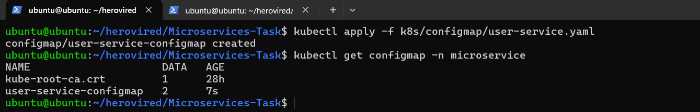
#### 📄 2 Create Deployment
**File:** `k8s/deployments/user-service.yaml`
```yaml
apiVersion: apps/v1
kind: Deployment
metadata:
  name: user-service
  labels:
    app: user-service
    tier: user-service
    environment: production
  namespace: microservice
spec:
  replicas: 1
  selector:
    matchLabels:
      app: user-service
  template:
    metadata:
      labels:
        app: user-service
        tier: user-service
        environment: production
    spec:
      restartPolicy: Always
      containers:
      - name: user-service
        image: securelooper/user-service:latest
        imagePullPolicy: Always
        ports:
        - containerPort: 3000
        env:
          - name: NODE_ENV
            valueFrom:
              configMapKeyRef:
                name: user-service-configmap
                key: NODE_ENV
          - name: PORT
            valueFrom:
              configMapKeyRef:
                name: user-service-configmap
                key: PORT
        resources:
          requests:
            cpu: "100m"
            memory: "128Mi"
          limits:
            cpu: "200m"
            memory: "256Mi"
        livenessProbe:
          httpGet:
            path: /health
            port: 3000
          initialDelaySeconds: 60
          periodSeconds: 10
        readinessProbe:
          httpGet:
            path: /health
            port: 3000
          initialDelaySeconds: 40
          periodSeconds: 5
```
📌 **Apply Deployment**
```bash
kubectl apply -f k8s/deployments/user-service.yaml
```
🔍 **Verify Pods**
```bash
kubectl get pods -n microservice
```
📜 **View Logs to Confirm Communication**
```
kubectl logs deploy/user-service -n microservice
```
OR
```
kubectl logs pod/<pod_name> -n microservice
```
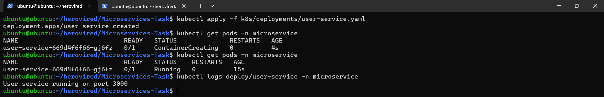

🐞 Describe Pod for Debugging and Event Inspection
- Use the following command to inspect pod details and events:
```
kubectl describe pod/<pod_name> -n microservice
```
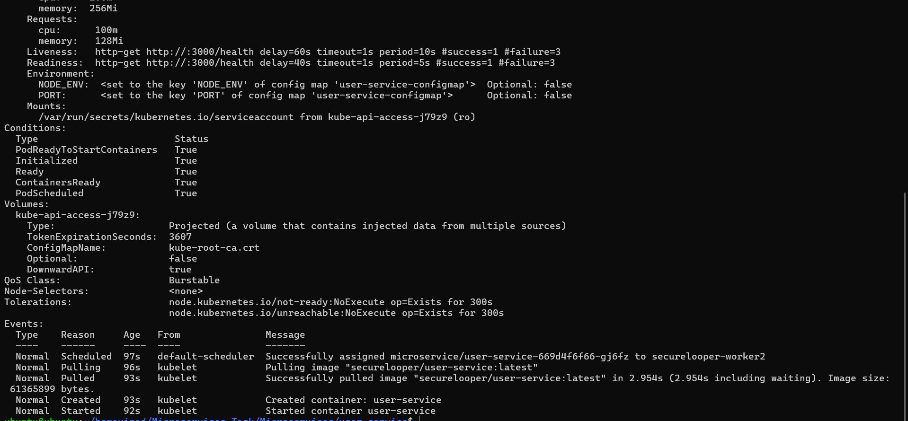

#### 📄 3 Create Service
**File:** `k8s/services/user-service.yaml`
```yaml
apiVersion: v1
kind: Service
metadata:
  name: user-service
  namespace: microservice
  labels:
    app: user-service
    tier: user-service
    environment: production
spec:
  selector:
    app: user-service
  ports:
  - protocol: TCP
    port: 3000
    targetPort: 3000
  type: ClusterIP
```

📌 **Apply Service**
```bash
kubectl apply -f k8s/services/user-service.yaml
```
🔍 **Verify Service**
```bash
kubectl get svc -n microservice
```


🔁 **Test Inter-Service Communication Using cURL**
Run a shell inside the user pod:
```
kubectl exec -it deploy/user-service -n microservice -- sh
```
From inside the pod, test communication:
```
curl http://user-service.microservice.svc.cluster.local:3000/health
```
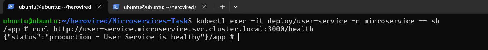


#### 🧪 4 Test with Port Forwarding
```bash
kubectl port-forward service/user-service -n=microservice 3000:3000 --address=0.0.0.0
```
🌍 Access the service in your browser or tool like Postman:
run it
```bash
http://localhost:3000/users
```


---

## 📦 Product Service
#### 🐳 Steps to Deploy an Application on Docker
📁 Create a `Dockerfile` inside the `product-service` directory:

```Dockerfile
FROM node:24-alpine

WORKDIR /app

COPY package*.json ./
COPY . .

RUN npm install

EXPOSE 3001

CMD ["node", "app.js"]
```

### 🔍 Local Testing & Validation

Build the Docker image:

```bash
docker image build --no-cache -t securelooper/product-service .
```


Push the image to Docker Hub.
```bash
docker image push securelooper/product-service
```
Run the container:

```bash
docker container run -d --name product-service -p 3001:3001 --network microservice -e NODE_ENV=production -e PORT=3001 securelooper/product-service
```

* **Base URL:** `http://localhost:3001`
* **Endpoint for List Products:**
    ```bash
    curl http://localhost:3001/products
    ```

    Or open in browser: [http://localhost:3001/products](http://localhost:3001/products)


### ☸️ Steps to Deploy an Application on Kubernetes

#### 🗂️ 1. Create ConfigMap
📄 **File**: `k8s/configmap/product-service.yaml`
```yaml
apiVersion: v1
kind: ConfigMap
metadata:
  name: product-service-configmap
  namespace: microservice
data:
  NODE_ENV: "production"
  PORT: "3001"
```
📌 **Apply ConfigMap**
```bash
kubectl apply -f k8s/configmap/product-service.yaml
```
🔍 **Verify ConfigMap**
```bash
kubectl get configmap -n microservice
```
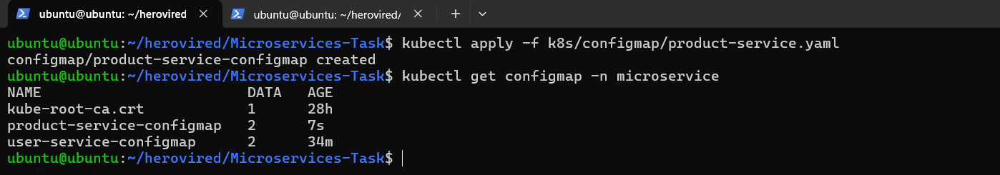
#### 📄 2 Create Deployment
**File:** `k8s/deployments/product-service.yaml`
```yaml
apiVersion: apps/v1
kind: Deployment
metadata:
  name: product-service
  labels:
    app: product-service
    tier: product-service
    environment: production
  namespace: microservice
spec:
  replicas: 1
  selector:
    matchLabels:
      app: product-service
  template:
    metadata:
      labels:
        app: product-service
        tier: product-service
        environment: production
    spec:
      restartPolicy: Always
      containers:
      - name: product-service
        image: securelooper/product-service:latest
        imagePullPolicy: Always
        ports:
        - containerPort: 3001
        env:
          - name: NODE_ENV
            valueFrom:
              configMapKeyRef:
                name: product-service-configmap
                key: NODE_ENV
          - name: PORT
            valueFrom:
              configMapKeyRef:
                name: product-service-configmap
                key: PORT
        resources:
          requests:
            cpu: "100m"
            memory: "128Mi"
          limits:
            cpu: "200m"
            memory: "256Mi"
        livenessProbe:
          httpGet:
            path: /health
            port: 3001
          initialDelaySeconds: 60
          periodSeconds: 10
        readinessProbe:
          httpGet:
            path: /health
            port: 3001
          initialDelaySeconds: 40
          periodSeconds: 5
```
📌 **Apply Deployment**
```bash
kubectl apply -f k8s/deployments/product-service.yaml
```
🔍 **Verify Pods**
```bash
kubectl get pods -n microservice
```
📜 **View Logs to Confirm Communication**
```
kubectl logs deploy/product-service -n microservice
```
OR
```
kubectl logs pod/<pod_name> -n microservice
```
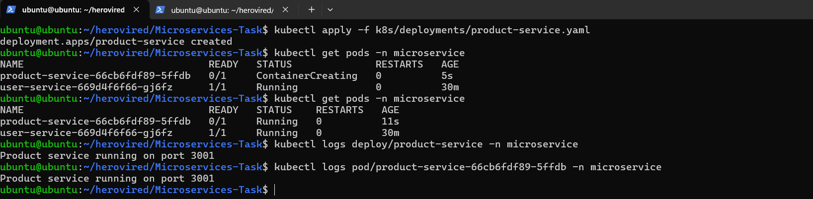

🐞 Describe Pod for Debugging and Event Inspection
- Use the following command to inspect pod details and events:
```
kubectl describe pod/<pod_name> -n microservice
```
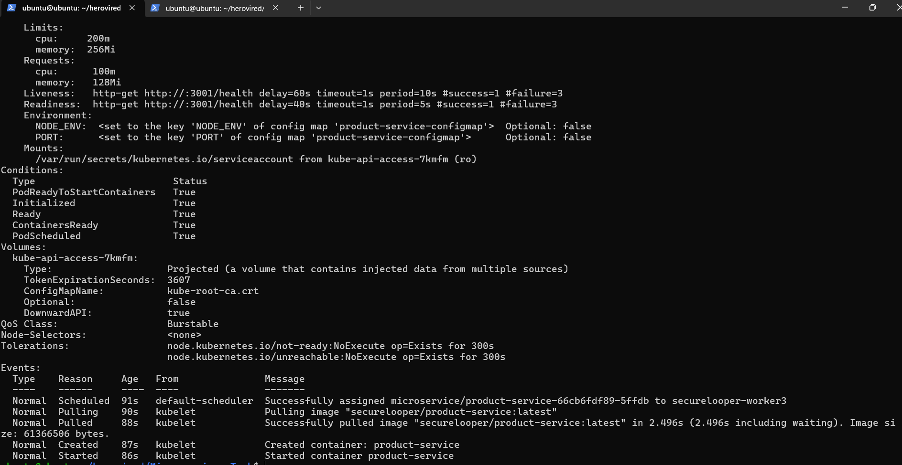

#### 📄 3 Create Service
**File:** `k8s/services/product-service.yaml`
```yaml
apiVersion: v1
kind: Service
metadata:
  name: product-service
  namespace: microservice
  labels:
    app: product-service
    tier: product-service
    environment: production
spec:
  selector:
    app: product-service
  ports:
  - protocol: TCP
    port: 3001
    targetPort: 3001
  type: ClusterIP
```

📌 **Apply Service**
```bash
kubectl apply -f k8s/services/product-service.yaml
```
🔍 **Verify Service**
```bash
kubectl get svc -n microservice
```

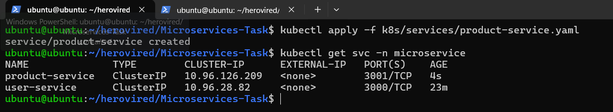

🔁 **Test Inter-Service Communication Using cURL**
Run a shell inside the Product pod:
```
kubectl exec -it deploy/product-service -n microservice -- sh
```
From inside the pod, test communication:
```
curl http://product-service.microservice.svc.cluster.local:3001/health
```
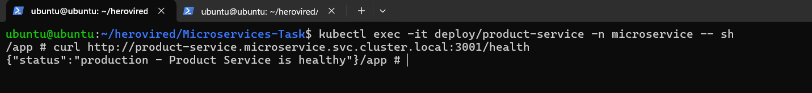


#### 🧪 4 Test with Port Forwarding
```bash
kubectl port-forward service/product-service -n=microservice 3001:3001 --address=0.0.0.0
```
🌍 Access the service in your browser or tool like Postman:
run it
```bash
http://localhost:3001/products
```


---

## 🧾 Order Service
#### 🐳 Steps to Deploy an Application on Docker
📁 Create a `Dockerfile` inside the `order-service` directory:

```Dockerfile
FROM node:24-alpine

WORKDIR /app

COPY package*.json ./
COPY . .

RUN npm install

EXPOSE 3002

CMD ["node", "app.js"]
```

### 🔍 Local Testing & Validation

Build the Docker image:

```bash
docker image build --no-cache -t securelooper/order-service .
```


Push the image to Docker Hub.
```bash
docker image push securelooper/order-service
```
Run the container:

```bash
docker container run -d --name order-service -p 3002:3002 --network microservice -e NODE_ENV=production -e PORT=3002 securelooper/order-service
```

* **Base URL:** `http://localhost:3002`
* **Endpoint for List Orders:**
    ```bash
    curl http://localhost:3002/orders
    ```

    Or open in browser: [http://localhost:3002/orders](http://localhost:3002/orders)


### ☸️ Steps to Deploy an Application on Kubernetes

#### 🗂️ 1. Create ConfigMap
📄 **File**: `k8s/configmap/order-service.yaml`
```yaml
apiVersion: v1
kind: ConfigMap
metadata:
  name: order-service-configmap
  namespace: microservice
data:
  NODE_ENV: "production"
  PORT: "3002"
```
📌 **Apply ConfigMap**
```bash
kubectl apply -f k8s/configmap/order-service.yaml
```
🔍 **Verify ConfigMap**
```bash
kubectl get configmap -n microservice
```
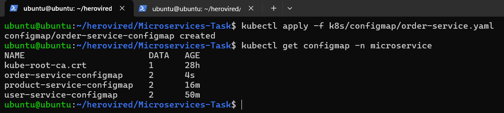
#### 📄 2 Create Deployment
**File:** `k8s/deployments/order-service.yaml`
```yaml
apiVersion: apps/v1
kind: Deployment
metadata:
  name: order-service
  labels:
    app: order-service
    tier: order-service
    environment: production
  namespace: microservice
spec:
  replicas: 1
  selector:
    matchLabels:
      app: order-service
  template:
    metadata:
      labels:
        app: order-service
        tier: order-service
        environment: production
    spec:
      restartPolicy: Always
      containers:
      - name: order-service
        image: securelooper/order-service:latest
        imagePullPolicy: Always
        ports:
        - containerPort: 3002
        env:
          - name: NODE_ENV
            valueFrom:
              configMapKeyRef:
                name: order-service-configmap
                key: NODE_ENV
          - name: PORT
            valueFrom:
              configMapKeyRef:
                name: order-service-configmap
                key: PORT
        resources:
          requests:
            cpu: "100m"
            memory: "128Mi"
          limits:
            cpu: "200m"
            memory: "256Mi"
        livenessProbe:
          httpGet:
            path: /health
            port: 3002
          initialDelaySeconds: 60
          periodSeconds: 10
        readinessProbe:
          httpGet:
            path: /health
            port: 3002
          initialDelaySeconds: 40
          periodSeconds: 5
```
📌 **Apply Deployment**
```bash
kubectl apply -f k8s/deployments/order-service.yaml
```
🔍 **Verify Pods**
```bash
kubectl get pods -n microservice
```
📜 **View Logs to Confirm Communication**
```
kubectl logs deploy/order-service -n microservice
```
OR
```
kubectl logs pod/<pod_name> -n microservice
```
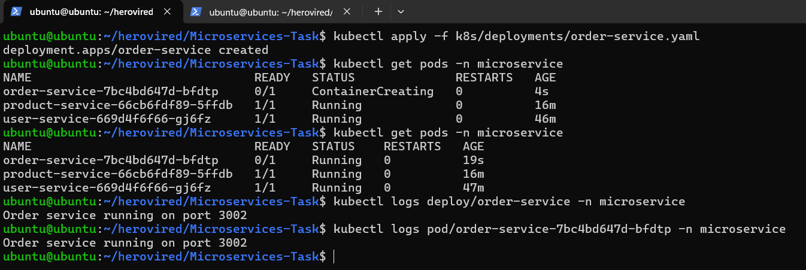

🐞 Describe Pod for Debugging and Event Inspection
- Use the following command to inspect pod details and events:
```
kubectl describe pod/<pod_name> -n microservice
```
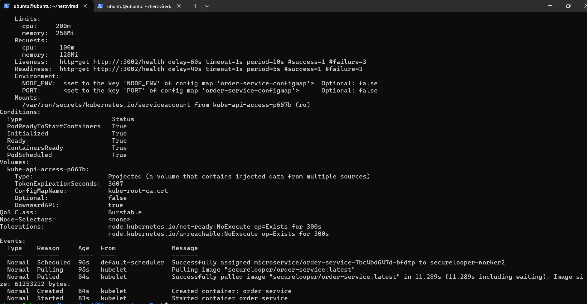

#### 📄 3 Create Service
**File:** `k8s/services/order-service.yaml`
```yaml
apiVersion: v1
kind: Service
metadata:
  name: order-service
  namespace: microservice
  labels:
    app: order-service
    tier: order-service
    environment: production
spec:
  selector:
    app: order-service
  ports:
  - protocol: TCP
    port: 3002
    targetPort: 3002
  type: ClusterIP
```

📌 **Apply Service**
```bash
kubectl apply -f k8s/services/order-service.yaml
```
🔍 **Verify Service**
```bash
kubectl get svc -n microservice
```

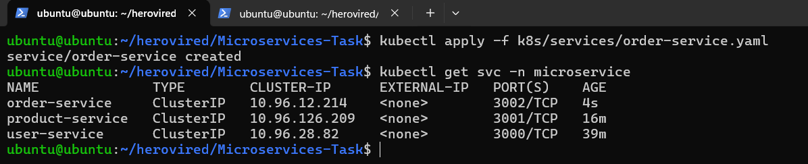

🔁 **Test Inter-Service Communication Using cURL**
Run a shell inside the Order pod:
```
kubectl exec -it deploy/order-service -n microservice -- sh
```
From inside the pod, test communication:
```
curl http://order-service.microservice.svc.cluster.local:3002/health
```
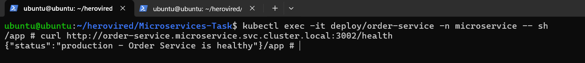


#### 🧪 4 Test with Port Forwarding
```bash
kubectl port-forward service/order-service -n=microservice 3002:3002 --address=0.0.0.0
```
🌍 Access the service in your browser or tool like Postman:
run it
```bash
http://localhost:3002/orders
```


---

### 🌐 Gateway Service
#### 🐳 Steps to Deploy an Application on Docker

📁 Create a `Dockerfile` inside the `gateway-service` directory:

```Dockerfile
FROM node:24-alpine

WORKDIR /app

COPY package*.json ./
COPY . .

RUN npm install

EXPOSE 3003

CMD ["node", "app.js"]
```

### 🔍 Local Testing & Validation

Build the Docker image:

```bash
docker image build --no-cache -t securelooper/gateway-service .
```


Push the image to Docker Hub.
```bash
docker image push securelooper/gateway-service
```
Run the container:

```bash
docker container run -d --name gateway-service -p 3003:3003 --network microservice -e NODE_ENV=production -e PORT=3002 securelooper/gateway-service
```

* **Base URL:** `http://localhost:3003/api`
* **Endpoints:**

  * **Users:** [http://localhost:3003/api/users](http://localhost:3003/api/users)

  

  * **Products:** [http://localhost:3003/api/products](http://localhost:3003/api/products)

  

  * **Orders:** [http://localhost:3003/api/orders](http://localhost:3003/api/orders)
  
  

### ☸️ Steps to Deploy an Application on Kubernetes

#### 🗂️ 1. Create ConfigMap
📄 **File**: `k8s/configmap/gateway-service.yaml`
```yaml
apiVersion: v1
kind: ConfigMap
metadata:
  name: gateway-service-configmap
  namespace: microservice
data:
  NODE_ENV: "production"
  PORT: "3003"
  USER_API_URL: 'http://user-service.microservice.svc.cluster.local:3000'
  PRODUCT_API_URL: 'http://product-service.microservice.svc.cluster.local:3001'
  ORDER_API_URL: 'http://order-service.microservice.svc.cluster.local:3002'
```
📌 **Apply ConfigMap**
```bash
kubectl apply -f k8s/configmap/gateway-service.yaml
```
🔍 **Verify ConfigMap**
```bash
kubectl get configmap -n microservice
```
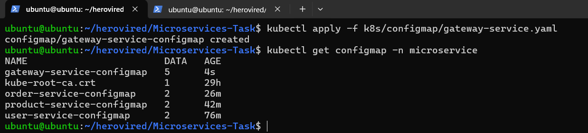
#### 📄 2 Create Deployment
**File:** `k8s/deployments/gateway-service.yaml`
```yaml
apiVersion: apps/v1
kind: Deployment
metadata:
  name: gateway-service
  labels:
    app: gateway-service
    tier: gateway-service
    environment: production
  namespace: microservice
spec:
  replicas: 1
  selector:
    matchLabels:
      app: gateway-service
  template:
    metadata:
      labels:
        app: gateway-service
        tier: gateway-service
        environment: production
    spec:
      restartPolicy: Always
      containers:
      - name: gateway-service
        image: securelooper/gateway-service:latest
        imagePullPolicy: Always
        ports:
        - containerPort: 3003
        envFrom:
        - configMapRef:
            name: gateway-service-configmap
        resources:
          requests:
            cpu: "100m"
            memory: "128Mi"
          limits:
            cpu: "200m"
            memory: "256Mi"
        livenessProbe:
          httpGet:
            path: /health
            port: 3003
          initialDelaySeconds: 60
          periodSeconds: 10
        readinessProbe:
          httpGet:
            path: /health
            port: 3003
          initialDelaySeconds: 40
          periodSeconds: 5
```
📌 **Apply Deployment**
```bash
kubectl apply -f k8s/deployments/gateway-service.yaml
```
🔍 **Verify Pods**
```bash
kubectl get pods -n microservice
```
📜 **View Logs to Confirm Communication**
```
kubectl logs deploy/gateway-service -n microservice
```
OR
```
kubectl logs pod/<pod_name> -n microservice
```
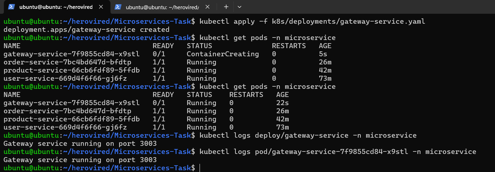

🐞 Describe Pod for Debugging and Event Inspection
- Use the following command to inspect pod details and events:
```
kubectl describe pod/<pod_name> -n microservice
```
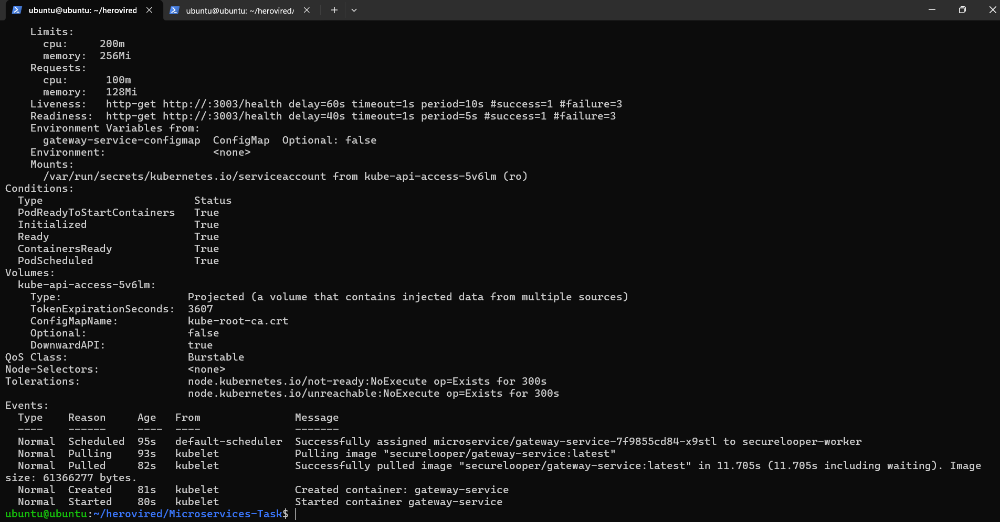

#### 📄 3 Create Service
**File:** `k8s/services/gateway-service.yaml`
```yaml
apiVersion: v1
kind: Service
metadata:
  name: gateway-service
  namespace: microservice
  labels:
    app: gateway-service
    tier: gateway-service
    environment: production
spec:
  selector:
    app: gateway-service
  ports:
  - protocol: TCP
    port: 3003
    targetPort: 3003
  type: ClusterIP
```

📌 **Apply Service**
```bash
kubectl apply -f k8s/services/gateway-service.yaml
```
🔍 **Verify Service**
```bash
kubectl get svc -n microservice
```

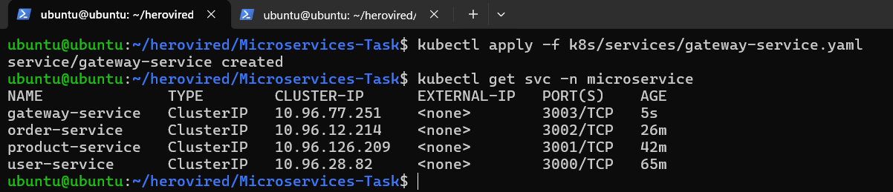

🔁 **Test Inter-Service Communication Using cURL**
Run a shell inside the Gateway pod:
```
kubectl exec -it deploy/gateway-service -n microservice -- sh
```
From inside the pods, test communication:
```
curl http://user-service.microservice.svc.cluster.local:3000/health
curl http://product-service.microservice.svc.cluster.local:3001/health
curl http://order-service.microservice.svc.cluster.local:3002/health
curl http://gateway-service.microservice.svc.cluster.local:3003/health
```
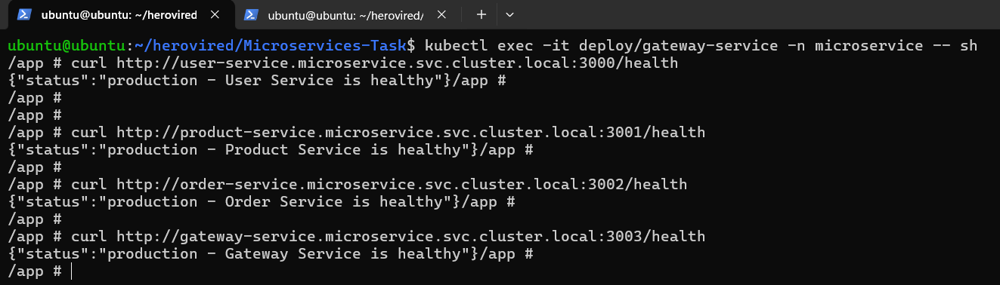


#### 🧪 4 Test with Port Forwarding
```bash
kubectl port-forward service/gateway-service -n=microservice 3003:3003 --address=0.0.0.0
```
🌍 Access the service in your browser or tool like Postman:
run it
👤 **User Service**
```bash
http://localhost:3003/api/users
```


🛒 **Product Service**
```bash
http://localhost:3003/api/products
```


📦 **Order Service**
```bash
http://localhost:3003/api/orders
```


---

### 🌐 Ingress Setup with Minikube

##### 🔌 Step 1: Enable Ingress Addon
```
minikube addons enable ingress
```
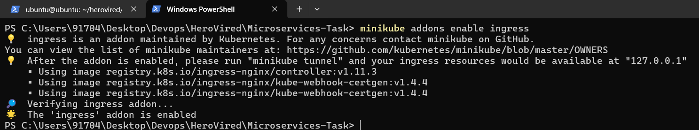

##### 🚀 Step 2: Apply Ingress Configuration
##### 📄 Create Ingress
**File:** `k8s/ingress/ingress.yaml`
```yaml
apiVersion: networking.k8s.io/v1
kind: Ingress
metadata:
  name: microservices-ingress
  namespace: microservice
  annotations:
    nginx.ingress.kubernetes.io/rewrite-target: /$2
spec:
  rules:
    - http:
        paths:
          - path: /api/users(/|$)(.*)
            pathType: Prefix
            backend:
              service:
                name: user-service
                port:
                  number: 3000
          - path: /api/products(/|$)(.*)
            pathType: Prefix
            backend:
              service:
                name: product-service
                port:
                  number: 3001
          - path: /api/orders(/|$)(.*)
            pathType: Prefix
            backend:
              service:
                name: order-service
                port:
                  number: 3002
          - path: /()(.*)
            pathType: Prefix
            backend:
              service:
                name: gateway-service
                port:
                  number: 3003

```

📌 **Apply Service**
```bash
kubectl apply -f k8s/ingress/ingress.yaml
```
🔍 **Verify Service**
```bash
kubectl get ingress -n microservice
```


##### 🚇 Step 3: Start Minikube Tunnel (Optional for LoadBalancer)
If your services are of type `LoadBalancer`, run:
```
minikube tunnel
```
This allows your local machine to access `LoadBalancer` services correctly.

🛣️ **Gateway Service**
```bash
http://localhost/health
```
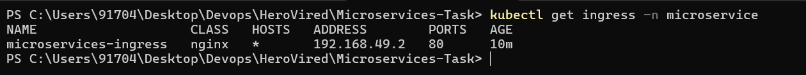

👤 **User Service**
```bash
http://localhost/api/users/health
```
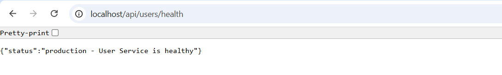

🛒 **Product Service**
```bash
http://localhost/api/products/health
```
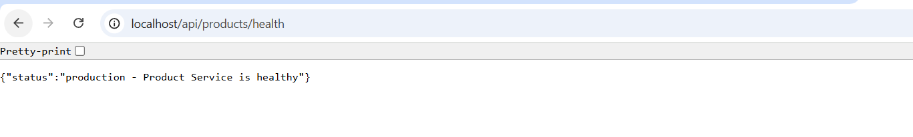

📦 **Order Service**
```bash
http://localhost/api/orders/health
```
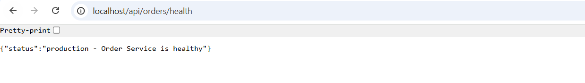

---

✅ Once all containers are running, access the respective endpoints to verify each service is functioning correctly.

## 📜 Project Information

### 📄 License Details
This project is released under the MIT License, granting you the freedom to:
- 🔓 Use in commercial projects
- 🔄 Modify and redistribute
- 📚 Use as educational material

## 📞 Contact

📧 Email: [Email Me](securelooper@gmail.com
)
🔗 LinkedIn: [LinkedIn Profile](https://www.linkedin.com/in/sagar-93-patel)  
🐙 GitHub: [GitHub Profile](https://github.com/psagar-dev)  

---

<div align="center">
  <p>Built with ❤️ by Sagar Patel</p>
</div>