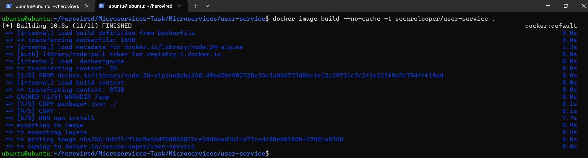
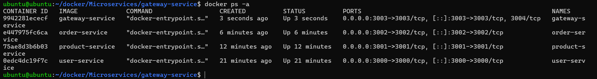

# 🚀 Microservices Task

## 📂 Project Structure

```
Microservices/
├── gateway-service/
│   ├── app.js
│   ├── Dockerfile
│   └── package.json
├── order-service/
│   ├── app.js
│   ├── Dockerfile
│   └── package.json
├── product-service/
│   ├── app.js
│   ├── Dockerfile
│   └── package.json
├── user-service/
│   ├── app.js
│   ├── Dockerfile
│   └── package.json
├── images/
├── docker-compose.yml
├── .gitignore
├── LICENSE
└── README.md
```

## 📋 Overview

This document outlines the step-by-step process to build, run, and validate multiple microservices using `Docker` and `Docker Compose`. The services include:

* 👤 **User Service**
* 📦 **Product Service**
* 🧾 **Order Service**
* 🌐 **Gateway Service**

---

## 🌉 Create a Docker Network

Before running the services, create a Docker bridge network:

```bash
docker network create --driver bridge microservice
```

---

## 👤 User Service

📁 Create a `Dockerfile` inside the `user-service` directory:

```Dockerfile
FROM node:24-alpine

WORKDIR /app

COPY package*.json ./
COPY . .

RUN npm install

EXPOSE 3000

CMD ["node", "app.js"]
```

### 🔍 Local Testing & Validation

Build the Docker image:

```bash
docker image build -t user-service .
```



Run the container:

```bash
docker container run -d --name user-service -p 3000:3000 --network microservice user-service
```

* **Base URL:** `http://localhost:3000`
* **Endpoints:**

  * **List Users:**

    ```bash
    curl http://localhost:3000/users
    ```

    Or open in browser: [http://localhost:3000/users](http://localhost:3000/users)


---

## 📦 Product Service

📁 Create a `Dockerfile` inside the `product-service` directory:

```Dockerfile
FROM node:24-alpine

WORKDIR /app

COPY package*.json ./
COPY . .

RUN npm install

EXPOSE 3001

CMD ["node", "app.js"]
```

### 🔍 Local Testing & Validation

Build the Docker image:

```bash
docker image build -t product-service .
```


Run the container:

```bash
docker container run -d --name product-service -p 3001:3001 --network microservice product-service
```

* **Base URL:** `http://localhost:3001`
* **Endpoints:**

  * **List Products:**

    ```bash
    curl http://localhost:3001/products
    ```

    Or open in browser: [http://localhost:3001/products](http://localhost:3001/products)


---

## 🧾 Order Service

📁 Create a `Dockerfile` inside the `order-service` directory:

```Dockerfile
FROM node:24-alpine

WORKDIR /app

COPY package*.json ./
COPY . .

RUN npm install

EXPOSE 3002

CMD ["node", "app.js"]
```

### 🔍 Local Testing & Validation

Build the Docker image:

```bash
docker image build -t order-service .
```


Run the container:

```bash
docker container run -d --name order-service -p 3002:3002 --network microservice order-service
```

* **Base URL:** `http://localhost:3002`
* **Endpoints:**

  * **List Orders:**

    ```bash
    curl http://localhost:3002/orders
    ```

    Or open in browser: [http://localhost:3002/orders](http://localhost:3002/orders)


---

## 🌐 Gateway Service

📁 Create a `Dockerfile` inside the `gateway-service` directory:

```Dockerfile
FROM node:24-alpine

WORKDIR /app

COPY package*.json ./
COPY . .

RUN npm install

EXPOSE 3003

CMD ["node", "app.js"]
```

### 🔍 Local Testing & Validation

Build the Docker image:

```bash
docker image build -t gateway-service .
```


Run the container:

```bash
docker container run -d --name gateway-service -p 3003:3003 --network microservice gateway-service
```

* **Base URL:** `http://localhost:3003/api`
* **Endpoints:**

  * **Users:** [http://localhost:3003/api/users](http://localhost:3003/api/users)

  

  * **Products:** [http://localhost:3003/api/products](http://localhost:3003/api/products)

  

  * **Orders:** [http://localhost:3003/api/orders](http://localhost:3003/api/orders)
  
  

✅ You can check the container status:


---

## 🐳 Docker Compose Setup

📄 Create a `docker-compose.yml` file:

```yaml
services:
  user-service:
    build:
      context: ./user-service
    container_name: user-service
    ports:
      - "3000:3000"
    restart: always
    healthcheck:
      test: ["CMD", "curl", "-f", "http://localhost:3000/health"]
      interval: 30s
      timeout: 10s
      retries: 3
      start_period: 10s
    networks:
      - microservice

  product-service:
    build:
      context: ./product-service
    container_name: product-service
    ports:
      - "3001:3001"
    restart: always
    healthcheck:
      test: ["CMD", "curl", "-f", "http://localhost:3001/health"]
      interval: 30s
      timeout: 10s
      retries: 3
      start_period: 10s
    networks:
      - microservice

  order-service:
    build:
      context: ./order-service
    container_name: order-service
    ports:
      - "3002:3002"
    restart: always
    healthcheck:
      test: ["CMD", "curl", "-f", "http://localhost:3002/health"]
      interval: 30s
      timeout: 10s
      retries: 3
      start_period: 10s
    networks:
      - microservice

  gateway-service:
    build:
      context: ./gateway-service
    container_name: gateway-service
    ports:
      - "3003:3003"
    restart: always
    depends_on:
      - user-service
      - product-service
      - order-service
    healthcheck:
      test: ["CMD", "curl", "-f", "http://localhost:3003/health"]
      interval: 30s
      timeout: 10s
      retries: 3
      start_period: 10s
    networks:
      - microservice

networks:
  microservice:
    external: true
```

### ▶️ Start All Services

```bash
docker-compose up
```


### 🔍 Check Docker Images & Containers


---

✅ Once all containers are running, access the respective endpoints to verify each service is functioning correctly.


## 📜 Project Information

### 📄 License Details
This project is released under the MIT License, granting you the freedom to:
- 🔓 Use in commercial projects
- 🔄 Modify and redistribute
- 📚 Use as educational material

## 📞 Contact

📧 Email: [Email Me](securelooper@gmail.com
)
🔗 LinkedIn: [LinkedIn Profile](https://www.linkedin.com/in/sagar-93-patel)  
🐙 GitHub: [GitHub Profile](https://github.com/psagar-dev)  

---

<div align="center">
  <p>Built with ❤️ by Sagar Patel</p>
</div>